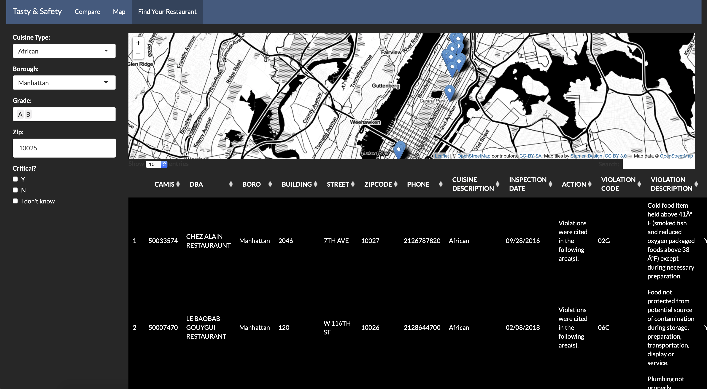

# Project 2: Shiny App Development Version 2.0

### [Project Description](doc/project2_desc.md)



In this second project of GR5243 Applied Data Science, we develop a version 2.0 of an *Exploratory Data Analysis and Visualization* shiny app on a topic of your choice using [NYC Open Data](https://opendata.cityofnewyork.us/) or U.S. government open data released on the [data.gov](https://data.gov/) website. See [Project 2 Description](doc/project2_desc.md) for more details.  

The **learning goals** for this project is:

- business intelligence for data science
- study legacy codes and further development
- data cleaning
- data visualization
- systems development/design life cycle
- shiny app/shiny server

*The above general statement about project 2 can be removed once you are finished with your project. It is optional.

## Project Title Lorem ipsum dolor sit amet
Term: Fall 2019

+ Team 6
+ **Projec title**: Food-Safety-Based Restaurant Recommandation App 
+ **Team members**:
	+ Chen, Luyue
	+ He, Chongyu
	+ Kravitz, Adam
	+ Wu, Wenyue
	+ Zhuo, Na

+ **Project summary**: The App is for "Restaurant Recommandation" based on food safety and specific needs of users. In that app, users could explore the food-safety landscape in New York City among different boroughs. The whole app contains three overview tabs: Comparation, Map Overview and Restuarant Lookup.    
        
	+ Comparation  
	The first part "Comparation" is composed of top violations, inspection scores, and grade breakdowns using two set of    filters, which could let users know more about the overall violation situation. 
	
	+ Map Overview  
	The second part uses map to show avearge score for every borough. 
	
	+ Restuarant Lookup  
	The final part "Restaurant Lookup" would recommand restaurants according to cusine type, borough and grades provided by customers. In sum, the app could be used to know about restaurants in NYC and help users find their favorite choices. 

+ **Contribution statement**: ([default](doc/a_note_on_contributions.md)) All team members contributed equally in all stages of this project. All team members approve our work presented in this GitHub repository including this contributions statement. 

Following [suggestions](http://nicercode.github.io/blog/2013-04-05-projects/) by [RICH FITZJOHN](http://nicercode.github.io/about/#Team) (@richfitz). This folder is orgarnized as follows.

```
proj/
├── app/
├── lib/
├── data/
├── doc/
└── output/
```

Please see each subfolder for a README file.

